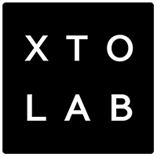

# 🔸 XTOLAB

<figure><figcaption></figcaption></figure>


**XTOLAB**

A studio belonging to the [SUPERNAD](https://supernad.com) corp

**Location**

B-511, 177, Jeongjail-ro, Bundang-gu, Seongnam-si, Gyeonggi-do, Republic of Korea

**Call**

+82 070-7677-2546


We are an indie game developer organized to make P2E games. We have many years of online MMORPG development and live service experience.

### SungYoung Hur

**CEO**&#x20;

* He is a server programmer with 20 years of experience and is a veteran programmer who participated in server design for Lineage 2 and Terra. He has extensive experience in developing and servicing MMORPGs, and is in charge of implementing all programs of EXTOCIUM.
* [Linkedin](https://www.linkedin.com/in/sungyounghur)

### Young Kwon

* As a game artist with 10 years of experience, she worked for NCsoft for 9 years. She has experience in the game development team and the Lineage 2 live team, and is in charge of game planning and game art for EXTOCIUM.
* [Linkedin](https://www.linkedin.com/in/young-k-ba35b9251/?locale=en_US)

### Lina Kwon

* She is fully responsible for CS.
