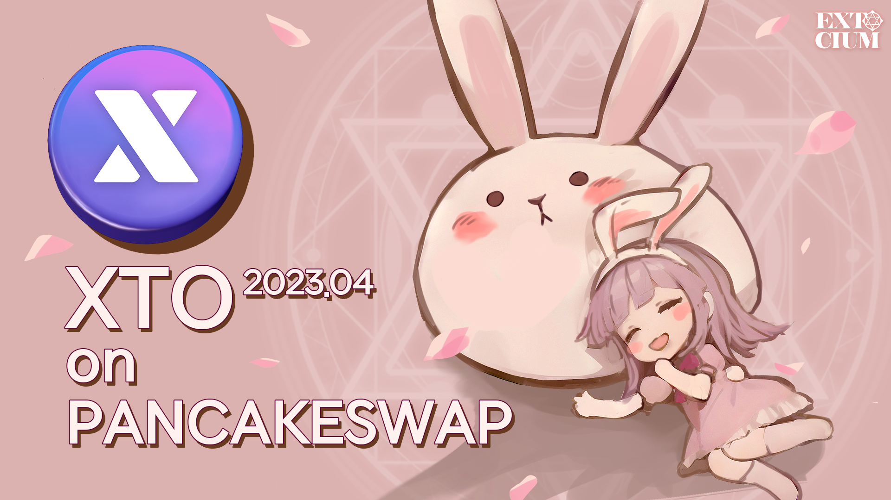

# 🔸 Pancakeswap

**You can trade XTO coins on** [**PancakeSwap**](https://pancakeswap.finance/)

<figure><figcaption></figcaption></figure> <figure><figcaption></figcaption></figure>

**How to P2P trade XTO coins on Pancakeswap**

* **Go to the Pancakeswap homepage and connect your metamask.**

<figure><figcaption></figcaption></figure>

1. Click the **Trade button** in the top left corner of the homepage.
2. When you hit the Trade button, you'll see a page like the screenshot above.
3. Number **2. is the coin you are selling** and number **3. is the coin you will receive as payment**.
4.  You can change to a different coin by clicking on each coin part.

    <figure><figcaption></figcaption></figure>

    Let's change the coin by clicking on CAKE.

    To find your XTO coin, **click Manage Tokens** in the pop-up window.

    <figure><figcaption></figcaption></figure>
5. Then **click Tokens**.
6. In the next window that appears, paste the address below.&#x20;
   1. **Contract Addr :&#x20;**<mark style="color:blue;">**0xAA390Bd1657514730D98BAaBcE4b393a53ACD579**</mark>

<figure><figcaption></figcaption></figure>

7. XTO's contract address can also be easily copied from the game screen.
8. Now you can import and trade your assets.

<figure><figcaption></figcaption></figure>

9. adjust the amount I will receive so that the Swap button at the bottom is in the "Available" state. (The price will continue to fluctuate based on the liquidity pool.)
10. and press the "Swap" button to proceed with the metamasked request.
